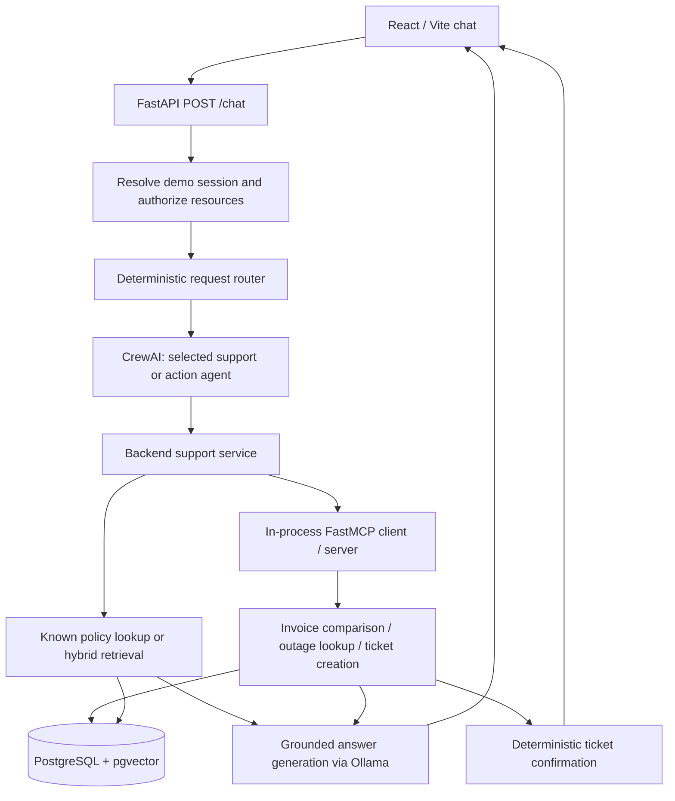
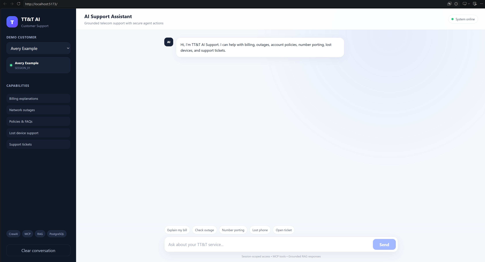

# TT&T Support AI

**An agentic telecom support application combining local language models, hybrid retrieval, and controlled operational tools.**

TT&T Support AI helps customers understand bill changes, find policy guidance, check outages, and request support tickets through a React chat interface. It connects account-specific facts with relevant policy evidence and displays source document IDs alongside supported answers.

TT&T is a fictional telecom carrier. This is a local portfolio MVP using synthetic demo data, with no affiliation to a real carrier.

## Features

- **Billing explanations:** compare the latest two invoices and combine changed charges with relevant policy documents.
- **Policy and FAQ support:** retrieve knowledge for questions about lost phones, plans, devices, and other telecom topics.
- **Outage lookup:** query outage records using the postal code resolved from the selected demo session.
- **Support tickets:** create a database-backed ticket through a restricted MCP tool and return its actual ID and status.
- **Session-scoped access:** resolve account and line context on the backend and reject detected cross-account or cross-line references before execution.
- **Source visibility:** return policy/document IDs with grounded responses.
- **Two agent roles:** a Support Resolution Agent for information requests and a Customer Action Agent for ticket requests.

## Architecture



The router selects one of two agent roles for each request. CrewAI produces an internal assessment; the backend then executes the selected workflow. Both agents do not run together on every request, and their assessment is not the authorization gate.

MCP tools wrap Python business logic and database operations. Agents are not given arbitrary SQL access or direct control of tool execution. The current FastMCP client connects to the server object in-process, so a separate MCP server terminal is unnecessary.

| MCP tool | Operation | Scope |
|---|---|---|
| `invoice_comparison` | Read | Compare invoices for the resolved account |
| `outage_lookup` | Read | Look up outages for the session postal code |
| `support_ticket_create` | Write | Create a validated ticket with an idempotency key |

`get_policy_chunks()` is an internal backend function, not an exposed MCP tool. Billing and outage workflows can retrieve known policy IDs directly; general knowledge questions use hybrid retrieval.

## Retrieval pipeline

1. Ingest Markdown policy documents and their metadata.
2. Split sections into approximately 180-word chunks with 25-word overlap.
3. Embed chunks using `BAAI/bge-small-en-v1.5` and store 384-dimensional vectors in pgvector.
4. Retrieve semantic and PostgreSQL full-text candidates, up to 20 from each branch.
5. Fuse rankings with Reciprocal Rank Fusion and keep up to 15 candidates.
6. Combine cross-encoder reranking, fusion, and metadata scores to select up to five chunks.
7. Generate a response from supplied evidence and return source document IDs.

The current reranker is `cross-encoder/ms-marco-MiniLM-L-6-v2`. Missing retrieval results trigger an insufficient-information response; retrieved evidence alone does not guarantee that every generated statement is correct.

## Technology stack

| Layer | Technology |
|---|---|
| Interface | React, Vite, JavaScript, CSS |
| API | Python, FastAPI, Pydantic, Uvicorn |
| Agent roles | CrewAI |
| Tool protocol | MCP through FastMCP |
| Local generation | Ollama, `llama3.2:3b` |
| Database | PostgreSQL 16, pgvector, Psycopg |
| Retrieval | Sentence Transformers, PostgreSQL full-text search, RRF, cross-encoder reranking |
| Local infrastructure | Docker Compose; existing development environment uses Conda |

## Repository structure

The implementation currently uses this layout. Documentation assets listed separately below are publishing additions.

```text
app/                       # API entry point and request/response schemas
packages/
  crew/                    # Agent definitions and orchestration
  llm/                     # Ollama client and grounded answer generation
  mcp_client/              # Controlled MCP calls
  mcp_server/              # Tools, policy lookup, and database access
  router/                  # Deterministic routing
  security/                # Demo-session context and resource authorization
  support_service.py       # Operational and retrieval workflows
frontend/                  # React application and frontend package manifest
db/init/                   # Extension and retrieval schema initialization SQL
data/
  config/                  # Demo sessions and configuration
  schemas/                 # Operational schema
  operational/             # Synthetic operational fixtures
  knowledge/               # Policy documents and metadata
  evaluation/              # Evaluation cases and expected results
scripts/                   # Data loading, ingestion, evaluation, smoke checks
reports/                   # Saved retrieval evaluation JSON and CSV
docker-compose.yml         # Local PostgreSQL service
```

Recommended additions: `README.md`, `.gitignore`, `.env.example`, a tested Python dependency manifest, `docs/screenshots/`, `docs/PUBLISHING_CHECKLIST.md`, and a license chosen by the author.

## Local setup

### Prerequisites and reproducibility status

Install Git, Docker Desktop, Ollama, Python/Conda, and a Node.js version compatible with the committed frontend dependencies. Initial model downloads require internet access and disk space.

The existing demo has been reported working. A root Python dependency manifest was absent during documentation review, and the fresh-database bootstrap has not been executed as part of that review. Before publishing a reproducible release, capture the working Python and Node versions, add a tested dependency manifest, and validate the fresh-clone path below.

### 1. Get the code and Python environment

Replace `YOUR_USERNAME` with the repository owner:

```powershell
git clone https://github.com/YOUR_USERNAME/ttt-support-ai.git
cd ttt-support-ai
```

On the existing development machine:

```powershell
conda activate project_grow
```

For a new machine, create an environment using the release's tested Python version and install its committed dependency manifest. Do not assume that `project_grow` exists on another machine. The maintainer must supply and test that manifest before this path is complete.

### 2. Configure local environment variables

Create a root `.env` using these application variable names. Choose your own local password; keep `.env` out of Git.

```dotenv
POSTGRES_DB=ttt
POSTGRES_USER=ttt
POSTGRES_PASSWORD=REPLACE_WITH_A_LOCAL_PASSWORD
POSTGRES_HOST=localhost
POSTGRES_PORT=5432
OLLAMA_MODEL=llama3.2:3b
EMBEDDING_MODEL=BAAI/bge-small-en-v1.5
RERANKER_MODEL=cross-encoder/ms-marco-MiniLM-L-6-v2
```

The database name and user above are suggested local values. An existing database volume must use its original credentials. CrewAI's model and Ollama URL are currently set in the agent definitions; changing `OLLAMA_MODEL` alone only changes the grounded-answer client.

### 3. Start PostgreSQL and prepare data

```powershell
docker compose up -d postgres
docker compose ps
```

Wait for `ttt_postgres` to become healthy. Compose mounts `db/init/` for first-start database initialization. That directory contains retrieval schema SQL; operational tables also need `data/schemas/schema.sql` applied before loading fixtures.

On a **fresh, isolated demo database**, the following is the proposed bootstrap sequence to validate before release. Replace the database/user values if configured differently:

```powershell
docker cp data/schemas/schema.sql ttt_postgres:/tmp/ttt-schema.sql
docker exec ttt_postgres psql -U ttt -d ttt -v ON_ERROR_STOP=1 -f /tmp/ttt-schema.sql
python scripts/load_operational_data.py
python scripts/ingest_knowledge.py
```

Do not rerun the operational schema or loader against an already populated database as a routine startup step. Database initialization scripts run only when the volume is first created; adding an SQL file does not automatically migrate an existing volume. Preserve existing demo data while resolving schema differences.

### 4. Prepare Ollama

```powershell
ollama list
ollama pull llama3.2:3b
```

The pull is needed only when the model is missing. If Ollama is not running, open its application or run `ollama serve` in a separate terminal. A port-in-use error on `11434` can mean it is already running.

### 5. Start the backend

From the repository root, with the Python environment active:

```powershell
uvicorn app.main:app --reload
```

- API: <http://127.0.0.1:8000>
- Health: <http://127.0.0.1:8000/health>
- Interactive API documentation: <http://127.0.0.1:8000/docs>

The health route returns `status: ok`; it is a basic API liveness response, not a comprehensive database/model readiness test. The root URL can return 404 because no root route is defined.

### 6. Start the frontend

In a separate terminal:

```powershell
cd frontend
npm ci
npm run dev
```

Use `npm ci` when the committed lockfile is present. If preparing the initial lockfile, use `npm install` once, review the result, and commit it. Open <http://localhost:5173> and select a seeded demo session.

The frontend currently calls `http://127.0.0.1:8000/chat`. Configure this address and backend CORS together if changing hosts or ports.

### Returning to the existing demo

Start Docker Desktop, run `docker start ttt_postgres`, verify Ollama with `ollama list`, then start Uvicorn and `npm run dev` in separate terminals. Data loading and ingestion are not required on every restart.

## Evaluation

The saved [retrieval report](reports/retrieval_evaluation.json) contains these results. They were read from the existing report, not rerun for this README.

| Metric | Saved result |
|---|---:|
| Cases in source file | 60 |
| Cases evaluated for policy retrieval | 27 |
| Cases skipped because no expected policy IDs were supplied | 33 |
| Mean Recall@1 | 68.52% |
| Mean Recall@3 | 87.04% |
| Mean Recall@5 | 90.74% |
| Hit rate@5 | 92.59% |
| All expected documents found@5 | 88.89% |
| Mean reciprocal rank | 0.7994 |

Evaluation deduplicates returned chunks into ranked document IDs. Recall measures the fraction of expected documents retrieved; hit rate measures whether at least one expected document appears; MRR rewards a relevant document appearing earlier.

These results describe policy retrieval over 27 labeled cases. They do not establish end-to-end answer accuracy, ticket correctness, authorization coverage, or performance over all 60 cases. Record a commit, dataset version, model configuration, run date, and hardware alongside future results.

To regenerate the retrieval report from the repository root:

```powershell
python scripts/evaluate_retrieval.py
```

Additional checks are present in `scripts/test_*.py` for routing, sessions, tools, grounded answers, and CrewAI integration. Some checks create tickets; run them on disposable synthetic data and inspect their assertions and exit behavior before using them as CI gates.

Future evaluation should measure:

| Area | Measurement |
|---|---|
| Answer grounding | Supported factual claims / reviewed factual claims |
| Routing | Correct route / labeled requests |
| Authorization | Blocked unauthorized attempts / attempted unauthorized requests |
| Ticket retries | Replays returning the same ticket with no extra row |
| Latency | End-to-end p50 and p95, with cold/warm runs separated |
| Reliability | Successful requests / requests attempted, with error categories |

No measured values are claimed for these additional metrics yet.

## Security and limitations

- Account, line, and postal-code context comes from backend demo-session resolution. Detected explicit account and line references are checked before workflows run.
- These are seeded, selectable demo sessions, not production identity authentication. Knowledge of a valid demo session must not grant access to real customer data in a deployed system.
- The model does not determine database account identifiers or execute arbitrary SQL. Tool access is mediated by backend code.
- Ticket idempotency uses the principal and request ID. Replaying the same request ID is the retry test; sending identical text with a new ID can create another ticket. If the caller omits the ID, the API generates one.
- The action agent's internal assessment is not used as an approval gate. Explicit-action behavior depends on the deterministic router and backend validation, which require negative testing.
- Evidence and source IDs improve reviewability but do not eliminate hallucinations or prompt-injection risk. Do not claim comprehensive attack resistance without testing it.
- Use only synthetic fixtures and sanitized screenshots. Keep credentials, local database files, model caches, and sensitive logs out of the repository.

This MVP is intended for local demonstration. Production identity, comprehensive authorization testing, rate limiting, deployment hardening, and operational monitoring remain future work. Outage responses reflect seeded database records, not a live carrier feed. Ticket creation does not itself issue a refund, suspend a line, or resolve a dispute.

## Demo questions

Use a seeded session whose fixtures support each scenario; the exact amounts and outcomes depend on its data.

| Question / action | What to show |
|---|---|
| “Why is my current bill higher than my previous bill?” | Invoice comparison and relevant policy sources |
| “Why was I charged a $35 activation fee?” | Billing facts and activation policy, if present |
| “I lost my phone. What should I do?” | Grounded guidance and source IDs |
| “Is there an outage in my area?” | Session-scoped outage lookup |
| “Please open a support ticket to review the $35 activation fee on my bill.” | Actual ticket ID and status |
| Replay that ticket API request with the same `request_id` | Same ticket, no duplicate database row |
| “Show me the bill for ACC_…”, using another fixture account's actual ID | Access blocked |
| Request another fixture account's actual `LINE_…` ID | Cross-line request blocked |
| “What are your international roaming policies?” | Policy retrieval |
| Ask for a detail absent from the evidence | Review whether the answer admits the limitation |

A concise demo sequence is billing → lost phone → outage → ticket → unauthorized account. Keep evaluation and retry checks available as supporting evidence.

## Screenshots

Capture the running application with synthetic data and save the images under `docs/screenshots/`. Use readable text, consistent browser width, and complete responses. Include source IDs and ticket status where relevant. Avoid terminal clutter, credentials, personal browser tabs, and local personal paths.

| Filename | Capture |
|---|---|
| `01-chat-overview.png` | Full UI, session selector, capabilities, and input |
| `02-billing-explanation.png` | Billing question, complete answer, policy IDs |
| `03-policy-rag.png` | Lost-phone guidance and visible sources |
| `04-outage-lookup.png` | Outage question and fixture-backed result |
| `05-ticket-created.png` | Explicit request, ticket ID, and status |
| `06-access-blocked.png` | Unauthorized fixture account request and refusal |
| `07-retrieval-evaluation.png` | Optional readable report summary with sample size |

After capture, embed the overview, billing, and ticket images here and link the remaining screenshots. Example Markdown, kept as code until the actual image exists:

```markdown

```

## Future work

- Package and validate a fully reproducible fresh-clone setup with pinned dependencies and automated database migrations.
- Add real authentication and server-side session lifecycle management before using non-synthetic data.
- Expand adversarial authorization, prompt-injection, and idempotent retry tests.
- Add end-to-end evaluations for correctness, citation support, and latency.
- Add structured traces and privacy-aware operational logging.
- Improve failure recovery and request retry behavior.
- Make model, API address, and deployment settings consistently configurable.
- Evaluate streaming responses and a human escalation workflow.
- Add additional write actions only with explicit scope, authorization, and action-specific safeguards.

## Publishing and license

Use the accompanying `docs/PUBLISHING_CHECKLIST.md` for repository naming, preparation, screenshots, validation, and GitHub publication. Publishing source code to GitHub does not host the running backend, database, or Ollama service.

Add an author-selected `LICENSE` before advertising an open-source license. Model weights, libraries, and any third-party data retain their own terms; do not bundle model weights into this repository.
